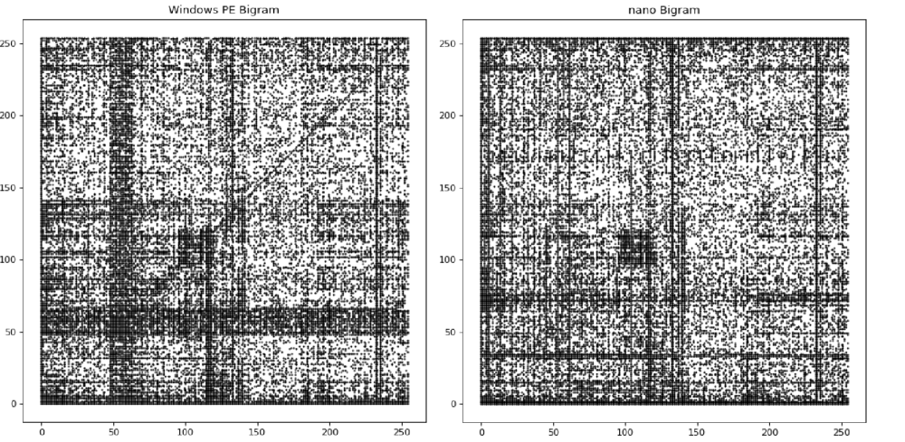
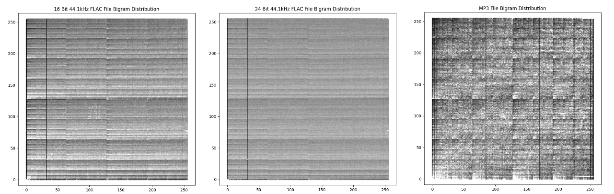

# bigram-file-analysis

This is a set of notebooks for generating bigram distributions of data (such as files or images) and analyzing them to attempt to determine what kind of files they are. Given an adequate volume of training samples, it is fairly accurate in its analysis and can easily be modified to scan "composite" file structures such as tars, compressed file systems, and disk images.

Why bigrams? Creating a frequency distribution chart of all possible bigrams, `{ (0x00, 0x00), (0x00,0x01), ... (0xFF, 0xFF) }` allows us to generate a fingerprint for any file that is represented as a 255x255 table of normalized integers. This chart clearly demonstrates, even to the human eye, a clear difference between different file types. 

For example, there are noticeable differences between the bigram charts for an ELF binary and a Windows PE:

The method also leads to visually distinct charts within file types. The difference between a FLAC and an MP3 is easy to spot, but it is also easy to see the difference between a 16-bit FLAC and a 24-bit FLAC as well:

Additionally, when tested with corruption such as deleting headers, small amounts of block corruption, and bit flipping corruption, the method was still able to successfully classify files. 
